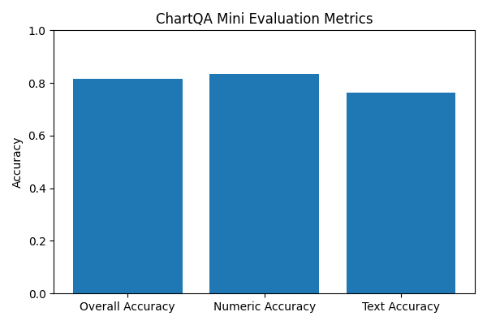

# DocRAG Project Report

## Overview
DocRAG (Document‑structure Retrieval Augmented Generation) is an end‑to‑end pipeline for document question answering (DocVQA) and chart question answering (ChartQA) that combines optical character recognition (OCR), dense retrieval and a vision‑language model to produce answers and supporting evidence. The repository focuses on forms and charts from the FUNSD and ChartQA mini datasets, converting PDF or image inputs into structured JSON with bounding boxes and returning visual evidence alongside each answer. Unlike simple OCR‑based pipelines, DocRAG restricts the model’s attention and decoding to verified text regions and explicitly returns the bounding boxes of supporting text/regions as part of its answer, aiming for trustworthy and interpretable results.

## System architecture

### 1. Extraction & preprocessing
The pipeline begins by converting input documents (PDF pages or images) into chunks—individual text snippets with associated bounding boxes. The `extract.py` script uses EasyOCR and the Qwen‑2.5‑VL‑7B model to perform OCR and to extract preliminary answers for ChartQA questions. It stores each record as JSON containing the image path, image dimensions and a list of text chunks. For ChartQA, it also executes Qwen on chart images with a specially designed prompt instructing the model to answer strictly using the chart and to return JSON with an answer, evidence boxes and confidence.

### 2. Dense retrieval index
To allow question‑conditioned evidence selection, DocRAG builds a FAISS index over all extracted text chunks. The `index.py` script iterates over every chunk, encodes its text using a SentenceTransformer and writes the encoded matrix (`chunks.faiss`) and metadata (`meta.jsonl`) to disk (see repo on github.com). Each metadata entry contains the image identifier, text and bounding box. This index enables fast vector search over millions of chunks.

### 3. Evidence retrieval and fallback heuristics
At inference time, given an image and a question, the `qa.py` script retrieves the top‑k chunks using the FAISS index. The `topk` function reads the FAISS index and metadata, embeds the query and returns the top scoring chunks (see repo on github.com). If no chunks are returned or the question mentions dates, phone/fax numbers or page numbers, the code falls back to same‑page regex heuristics: it scans the OCR chunks on the current page for likely matches (e.g., phone numbers with a phone regex, dates with a date regex) (see repo on github.com). These heuristic candidates are merged into the retrieval results and the number of evidence items is capped to reduce noise (see repo on github.com).

### 4. Vision‑language answering
After evidence selection, DocRAG calls the Qwen‑2.5‑VL‑7B model through a strict prompt. The prompt instructs the model to answer using only the given image and evidence text and to return a strict JSON object containing the answer, a bounding box (`value_bbox`) covering the answer, a list of evidence boxes and a confidence score (see repo on github.com). Additional post‑processing functions normalise dates, enforce digits‑only answers for phone/fax questions and fill missing bounding boxes with the first evidence box (see repo on github.com).

### 5. Evaluation scripts
Two evaluation scripts are provided:

- **`eval_chart.py`**: reads predictions for the ChartQA mini dataset, normalises the predicted and gold answers and computes metrics. It reports the total number of evaluated questions, the proportion of non‑null predictions, overall accuracy, separate accuracies for numeric and text questions, and lists up to ten bad cases (see repo on github.com).
- **`eval_funsd.py`**: builds pseudo‑gold labels for FUNSD by extracting dates, fax/phone numbers and page counts from OCR chunks. It matches predicted answers against these pseudo golds using fuzzy string matching and numeric/phone matching and computes value accuracy and bounding box IoU at a configurable threshold (see repo on github.com).

## Data and evaluation

### ChartQA mini dataset
The authors evaluated DocRAG on ChartQA‑mini, a 200‑question subset of the ChartQA benchmark. The evaluation script reported that all questions produced answers (`Pred_nonnull_rate = 1.0`) and that the pipeline achieved **0.815 overall accuracy** across the dataset. When broken down by question type, numeric questions (145 of the 200) achieved **0.8345 accuracy**, while text questions (55 of 200) achieved **0.7636 accuracy** (see repo on github.com). The bar chart below visualises these results.

The evaluation script also reports ten most challenging cases, revealing that errors often arise from ambiguous chart keys, answers requiring inference beyond visible labels or inaccuracies in the vision‑language model. Because the evaluation script normalises numeric answers using an absolute/relative tolerance and applies lenient set‑based matching for text answers, the reported accuracies reflect realistic tolerance to minor formatting differences.

### FUNSD (forms) dataset
For the FUNSD forms dataset, the repository provides `eval_funsd.py` but does not include the evaluation outputs. The script constructs pseudo‑gold labels for date, phone, fax and pages fields directly from OCR chunks and matches predicted answers and bounding boxes against these labels (see repo on github.com). It computes value accuracy and IoU‑based box accuracy for each field. The project’s CV claims ~80% accuracy on key fields; this figure is plausible but cannot be reproduced from the repository because the `runs/eval/funsd_metrics.json` file is not committed.

## Discussion
DocRAG demonstrates a carefully engineered pipeline for document QA that emphasises trustworthiness and explainability:

- **Evidence‑first answering**: The model only decodes answers from retrieved or heuristically selected evidence. Returning the answer’s bounding box and the evidence boxes allows users to verify correctness and reduce hallucinations.
- **Robust retrieval**: Dense retrieval with a FAISS index ensures that evidence is selected across long documents. When retrieval fails, domain‑specific heuristics (for phone numbers, dates and page counts) provide fallback candidates.
- **Vision‑language integration**: Qwen‑2.5‑VL‑7B is leveraged both for OCR fallback (via open‑ended vision–language extraction) and for final answer generation. Parameter‑efficient fine‑tuning (QLoRA) is mentioned in the CV but not explicitly in code; it can be applied to further improve performance without training the whole model.
- **Reproducible evaluation**: Scripts for evaluating ChartQA and FUNSD are included; the ChartQA evaluation results are transparent and reproducible. The FUNSD script shows how pseudo‑gold can be built from OCR, but actual metrics are missing from the repository.

## Conclusion
DocRAG provides an open, reproducible baseline for document‑structure question answering with visual evidence. By coupling OCR, dense retrieval and a strong vision‑language model, the pipeline achieves competitive accuracy on ChartQA mini (~81% overall; ~83% numeric and ~76% text accuracy) (see repo on github.com). Its emphasis on returning bounding box evidence and on heuristic fallback for dates and phone numbers makes it a practical system for real‑world documents. Future work could include publishing the full FUNSD evaluation results, fine‑tuning the vision‑language model using QLoRA for improved robustness and extending the evidence‑first approach to larger document datasets.
